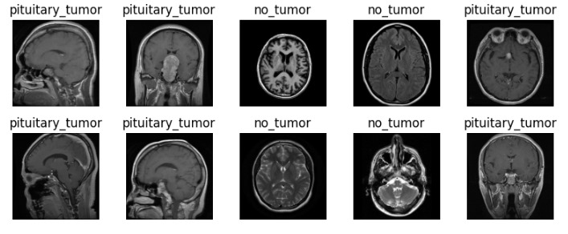

# Brain Tumor Classification from MRI Images using CNNs

This project employs **Convolutional Neural Networks (CNNs)** to classify brain tumors from MRI images. The model is trained to distinguish between two classes: *'No Tumor'* and *'Pituitary Tumor'*. With a focus on accuracy and sensitivity, this research contributes significantly to the field of medical diagnostics, leveraging machine learning to improve the precision of brain tumor detection.

## Table of Contents

- [Introduction](#introduction)
- [Dataset](#dataset)
- [Data Processing](#data-processing)
- [Model Architecture](#model-architecture)
- [Training and Hyperparameter Optimization](#training-and-hyperparameter-optimization)
- [Results](#results)
- [Future Scope](#future-scope)

---

## Introduction

Brain tumors represent a significant medical challenge, with timely and accurate diagnosis crucial for effective treatment. This project uses supervised learning techniques, specifically CNNs, to automate and enhance the classification process. The system aims to categorize MRI scans into predefined classes with high accuracy, supporting healthcare professionals in early diagnosis and treatment planning.

## Dataset

The dataset used in this project comprises MRI images of brain scans sourced from **Kaggle**. 

### Dataset Overview
                  
                  | **Description**       | **Details**                    |
                  |------------------------|-------------------------------|
                  | Dataset Title          | Brain Tumor MRI Images        |
                  | Classes                | 'No Tumor', 'Pituitary Tumor' |
                  | Image Format           | JPG                           |
                  | Total Images           | 1400                          |
                  | Training Set Size      | 1224                          |
                  | Testing Set Size       | 128                           |

---

***Sample Images***
---

---

## Data Processing

### Steps Involved:
1. **Data Loading**: Images are loaded using the OpenCV library.
2. **Conversion to Grayscale**: Images are converted to grayscale to simplify computations and focus on structural details.
3. **Blurring & Histogram Equalization**: Applied to enhance feature extraction by reducing noise and improving contrast.
4. **Resizing**: Images resized to a uniform dimension of `200x200` pixels.
5. **Normalization**: Pixel values normalized to [0, 1] range for faster and more stable training.

### Visualization of Preprocessing:
- **Blurred Images**:
  
- **Histogram Equalized Images**:
  

---

## Model Architecture

The CNN model is designed with layers to extract and classify features from MRI images efficiently. Below is a summary of the architecture:

1. **Convolutional Layers**:
   - Three convolutional layers with filters `[32, 64, 128]`, kernel size `3x3`, followed by max-pooling.
2. **Dense Layers**:
   - Two dense layers with 64 and 128 units, respectively, and ReLU activation.
3. **Output Layer**:
   - A dense layer with two units and softmax activation for binary classification.

**Model Summary**:
---

---

## Training and Hyperparameter Optimization

### Hyperparameters Tuned:
- **Optimizer**: Tested SGD, Adam, RMSProp.
- **Filters**: Ranged from 32 to 128.
- **Kernel Size**: 3x3, 5x5.
- **Learning Rate**: Tuned dynamically.

**Training Metrics:**
- Training and validation accuracy and loss were monitored to prevent overfitting.
- The best-performing model achieved **98.91% accuracy** on the test set.

### Training Process Visualization:
- **Training vs Validation Accuracy**:
---
  
  
---
- **Training vs Validation Loss**:
---
  
---

## Results

### Performance Metrics:
| **Metric**       | **Value** |
|-------------------|-----------|
| Accuracy          | 98.91%   |
| Precision         | 98.43%   |
| F1-Score          | 99.21%   |
| MAE               | 0.0367   |

### Confusion Matrix:
The confusion matrix demonstrates the model's effectiveness:

### Cnn Model Architechture

## Future Scope

The potential for enhancing this project is vast, with several promising avenues for further research and application. Here are some key areas for future work:

1. **Extend the Dataset**  
   - Incorporate additional tumor types into the dataset, such as gliomas, meningiomas, and metastatic tumors, to develop a more versatile classification system.
   - Utilize larger and more diverse datasets from multiple sources to improve model generalization.

2. **Employ Advanced Architectures**  
   - Experiment with state-of-the-art deep learning architectures such as **ResNet**, **EfficientNet**, or **Vision Transformers** to enhance classification accuracy and computational efficiency.
   - Leverage pre-trained models via transfer learning to reduce training time while achieving higher performance.

3. **Integrate Grad-CAM Visualizations**  
   - Implement **Gradient-weighted Class Activation Mapping (Grad-CAM)** to provide heatmaps that highlight regions of the MRI images influencing the model's predictions.  
   - This feature will improve interpretability, enabling medical professionals to understand the model’s decision-making process better.

4. **Explore Real-Time MRI Classification**  
   - Develop a real-time classification system using a mobile or web-based application.  
   - Enable healthcare providers to upload MRI scans directly to the platform and receive instant diagnostic results.  
   - Optimize the model for deployment on edge devices or cloud infrastructure to ensure scalability and accessibility.

By addressing these areas, the project can evolve into a robust and reliable tool for brain tumor detection, with the potential to make significant contributions to medical diagnostics and patient care.

  
